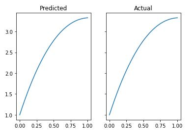

# The CantorProject

Partial differential equations (PDEs) and Ordinary Differential Equations (ODEs) are extensively used in 
the mathematical modelling of various problems in physics, engineering, finance and healthcare. In practical situations, 
these equations typically lack analytical solutions or are simply too difficult to solve and are hence solved 
numerically. In current practice, most numerical approaches to solve PDEs like finite element method (FEM), 
finite difference method (FDM) and finite volume method (FVM) are mesh based. A typical implementation of a 
mesh based approach involves three steps: 
1. Grid generation, 
2. Discretization of governing equation and 
3. Solution of the discretized equations with some iterative method.

However, there are limitations to these approaches. Some of the limitations of these methods are as follows:
1. They cannot be used to solve PDEs in complex computational domains because grid generation (step 1) itself becomes infeasible.
2. The process of discretization (step 2) creates a discrepancy between the mathematical nature of actual ODE/PDE
and its approximate difference equation. Sometimes this can lead to quite serious problems.

One of the options to fix these issues is to use neural networks. In this approach, the data set consists of some randomly
selected points in the domain and on the boundary, called the collocation points. The governing equations and the boundary conditions are fitted
using neural network. There are two main motivations for this approach. First, being universal approximators, neural
networks can potentially represent any ODE/PDE. So this avoids the discretization step and thus discretization based physics
errors too. Second, it is meshfree and therefore complex geometries can be easily handled. Initial work in this
direction can be credited to Lagaris et al. Firstly, they solved the initial boundary value problem using neural
networks and later extended their work to handle irregular boundaries. Since then, a lot of work has been done in
this field. In particular, we refer to the physics-informed neural networks (PINN) approach by
Raissi and Karniadakis and Raissi et. al. This approach has produced promising results for a series of
benchmark nonlinear problems.

In this project we have used the approach introduced by Maziar Raissi, Paris Perdikaris and George Em Karniadakis in their paper, 
Physics Informed Deep Learning (Part I): Data-driven Solutions of Nonlinear Partial Differential Equations (see citations at the bottom). 

### Contributions
The approach mentioned here is heavily based on the code I found [here](https://github.com/okada39/pinn_wave). I mostly added GPU
utilization as well as first order optimizers for faster convergence. I also came up with a cool name for the package:)

You could also read more about solving differential equations using Neural Nets at my blog post here: [Neural Netowrks and Differntial Equations](https://vanrao.medium.com/neural-networks-and-differential-equations-aa13887f4801)

## Table of Content

* [Library](#library)
* [Usage](#usage)
  * [Building the Gradient Layer](#building-the-gradient-layer)
  * [Preparing the Neural Net](#preparing-the-nn)
  * [Dataset Preparation](#dataset-preparation)
  * [Training using First Order Optimizers](#training-using-first-order-optimizers)
  * [Training using Quasi-Newtonian Methods](#training-using-quasi-newtonian-methods)
  * [Inference](#inference)
* [Conclusion](#conclusion)
* [Citations](#citations)

## Library
The cantorProject aims to bring a set of tools that can be used by researchers and students alike to solve differential equations 
using neural networks. The library currently uses Tensorflow 2.4, along with Scipy-Optimize and Tensorflow Proability for its functioning. The library provides, 
a simple class for constructing a neural network and then two other classes for optimizing the same, the choice of which is left to the user. In the tutorial 
that follows, we will demostrate how to utilize the tools provided by the library to solve an extremely simple ODE of the form, y'' + y' + y = 0, with the Cauchy 
condiotions being, y(0) = 1, and y'(0) = 5. The method illustrated, could be thus extended to solve much more complex equations, the solution to the harmonic 
oscillator being one of them, for which we have we have demostrated the solution in a Jupyter notebook, attached within the GitHub repo. 

## Usage
We will now leverage the tools offered by the library to solve an extremely simple ODE, for more examples related to the same, check out the jupyter notebooks, within the repo. 

### Building the Gradient Layer

We first demostrate the code that accomplishes the task, followed by an explaination of the code. 

```sh
class GradientLayer(tf.keras.layers.Layer):
    """
    Custom layer to compute 1st and 2nd derivatives of the neural net.
    Attributes:
        model: keras network model.
    """
    def __init__(self, model, **kwargs):
        """
        Args:
            model: keras network model.
        """
        self.model = model
        super().__init__(**kwargs)

    def call(self, x):
        """
        Computing 1st and 2nd derivatives of the neural net.
        Args:
            tx: input variables (x).
        Returns:
            u: network output.
            du_dx: 1st derivative of x.
            d2u_dx2: 2nd derivative of x.
        """
        with tf.GradientTape() as g:
            g.watch(x)
            with tf.GradientTape() as gg:
                gg.watch(x)
                u = self.model(x)
            du_dtx = gg.batch_jacobian(u, x)
            du_dx = du_dtx[..., 0]
        d2u_dtx2 = g.batch_jacobian(du_dtx, x)
        d2u_dx2 = d2u_dtx2[..., 0, 0]

        return u, du_dx, d2u_dx2
 ```

The code snippet as presented above creates a Gradient layer class, that helps us in calculating the gradient of the neural network, which is then
used by the loss function in order to convert the differential equation to an optimization problem. This gradient layer, as you can tell, returns 
three variables:
1. The output of the network 
2. The first derivative of the network with respect to the input and
3. It's second derivative with respect to the same. 

To modify the Gradient Layer class to accomodate for say PDEs we need only modify the call method, to return the diffrent partial derivatives involved in the process. 
For examples of the same, please refer to the attached notebooks. 

### Preparing the Neural Net
We now build the Neural Network, that we utilize to approximate the function that simulates the differential equation. 

```sh
import cantorProject as cp
network = cp.Network.build()
network.summary()
```
This code snippet construct an extremely simple neural network with 8 layers and 20 neurons in each. It uses the hyperbolic tangent activation in each of those layers,
by deafult. To modify the regular behaviour, we can pass in arguments as follows: 

```sh
neural_net = [30, 30, 30]
network = cp.Network.build(layers=neural_net, activation='selu')
network.summary()
```
The code snippet presented above produces a neural net with 3 layers and 30 neurons in each, with activation being the selu function. 

However, this only accomplishes half the task. For training, we require a wrapping of the above class, that can utilize the earlier created Gradient layer class 
to evaluate the differential equation, and naturally help us simulate the same. 

```sh
class PINN:
    """
    Build a wrapping for the above initialized neural net.
    Attributes:
        network: keras network model with input (x) and output u(x).
        grads: gradient layer.
    """

    def __init__(self, network):
        """
        Args:
            network: keras network model with input (x) and output u(x).
        """

        self.network = network
        self.grads = GradientLayer(self.network)

    def build(self):
        """
        Build a PINN model class as described by the PINN paper.
        Returns:
            PINN model for the projectile motion with
                input: [ (x) relative to equation,
                         (x=0) relative to initial condition ],
                output: [ u(x) relative to equation,
                          u(x=0) relative to initial condition,
                          du_dt(x=0) relative to initial derivative of x  ]
        """

        # equation input: (x)
        tx_eqn = tf.keras.layers.Input(shape=(1,))
        # initial condition input: (x)
        tx_ini = tf.keras.layers.Input(shape=(1,))

        # compute gradients
        u, du_dx,  d2u_dx2 = self.grads(tx_eqn)

        # equation output being zero
        u_eqn = d2u_dx2 + du_dx + u 
        # initial condition output
        u_ini, du_dx_ini, d2u_dx2  = self.grads(tx_ini)

        # build the PINN model
        return tf.keras.models.Model(
            inputs=[tx_eqn, tx_ini],
            outputs=[u_eqn, u_ini, du_dx_ini])
 ```
If you look closely at the code, you will realize that the PINN model, takes two inputs, one being the collocation points and the second being the boundary conditions. 
We calculate the derivatives and find the u_eqn which becomes our optimization problem. We follow it up with finding the intitial condition outputs which becomes part
of our output. From the problem we are trying to solve, we see that, tx_eqn could be any number (basically x) and forms the collocation points of our function, tx_ini is 
basically all just x=0, representing our Cauchy conditions. The outputs, u_eqn is always zero, since that's our optimization problem, u_ini is 1, as mentioned in the 
problem posed, whereas du_dx_ini is 5. 

```sh
pinn = PINN(network).build()
```

### Dataset Preparation
This is as described at the end of the previous section. We simply accumlate the values of all points we are trying to simulate, and combine them to form
the dataset. 

```sh
# create training input
tx_eqn = np.random.rand(num_train_samples, 1)
tx_eqn[..., 0] = 2*tx_eqn[..., 0] - 1              # x = -1 ~ +1
tx_ini = np.random.rand(num_train_samples, 1)
tx_ini[..., 0] = 0*tx_ini[..., 0]                  # x = 0
x_train = [tx_eqn, tx_ini]
```
```sh
u_zero = np.zeros((num_train_samples, 1))          # y = 0
u_ini = np.ones((num_train_samples, 1))            # y(0) = 1
du_dt_ini = 5 * np.ones((num_train_samples, 1))    # y'(0) = 5
y_train = [u_zero, u_ini, du_dt_ini]
```
NOTE: To replicate the results achieved by the author in the simulation use, num_train_samples=10000 and num_test_samples=1000. 

### Training using First Order Optimizers
First order optimizers such as RMSProp and Adam are widely used in ML, specifically in the field of deep learning to train large neural nets. However, one
main drawback of theirs is that they utilize only the first order derivative of the function to optimize the weights and biases. This leads to poor accuracy scores, hence, 
the use of first order derivatives is heavily discouraged. However, owing to great speed of convergence, we utilize first order optimizers to initially train the network before following it up with second order derivative based optimizers. 

### Training using Quasi-Newtonian Methods
The library currently supports only the L-BFGS methods, both as packaged using Scipy-Optimize and Tensorflow-Proabability. The following code is used to create the trainer
object that is then utilized to train the neural network. We demonstrate both the L-BFGS implementations: 

```sh
# Scipy-Optimize implementation of L-BFGS
sci_trainer = cp.sci_Trainer(pinn, x_train, y_train)
sci_trainer.train()
```

```sh
# Tensorflow-Proabability implementation of L-BFGS
tfp_trainer = cp.tfp_Trainer(pinn, x_train, y_train)
result = tfp_trainer.train()
cp.set_weights(tfp_trainer, pinn, result.position)
```
With this we have our neural net ready for predictions.

As with creating the neural net, the trainer also offers many modifications that can help us in custimizing the same. Let's see a code sample: 

```sh
# sci_Trainer arguments
sci_trainer = cp.sci_Trainer(model, x_train, y_train, first_order_trainer='rmsprop', batch_size=128, first_order_epochs=10,
                 factr=10, m=50, maxls=50, maxiter=15000)
```

1. model: The model to be trained, PINN in our case
2. x_train, y_train: The dataset to be used for optimization
3. first_order_trainer: The first order optimizer to be used, set first_order_epochs to zero, to avoid using the same
4. batch_size: batch size of the first order optimizer
5. first_order_epochs: Number of epochs for the first order optimizer 
6. factr: The iteration stops when (f^k - f^{k+1})/max{|f^k|,|f^{k+1}|,1} <= factr * eps, where eps is the machine precision, which is automatically generated by the code. Typical values for factr are: 1e12 for low accuracy; 1e7 for moderate accuracy; 10.0 for extremely high accuracy.
7. m: The maximum number of variable metric corrections used to define the limited memory matrix
8. maxls: Maximum number of line search steps (per iteration)
9. maxiter: Maximum number of iterations, for L-BFGS

```sh
# tfp_Trainer arguments
tfp_trainer = cp.tfp_Trainer(pinn, x_train, y_train, model, first_order_trainer='rmsprop', batch_size=128, 
                 first_order_epochs=10, bfgs_iter=100)
 ```
                 
1. model: The model to be trained, PINN in our case
2. x_train, y_train: The dataset to be used for optimization
3. first_order_trainer: The first order optimizer to be used, set first_order_epochs to zero, to avoid using the same
4. batch_size: batch size of the first order optimizer
5. first_order_epochs: Number of epochs for the first order optimizer
6. maxiter: Maximum number of iterations, for L-BFGS


### Inference
Let's now verify our results by plotting a graph of our predictions and that of the actual results to get a side by side comparison of the two. 

```sh
def actual_sol(x):
    return np.exp(-x/2) * (np.cos(((3**(0.5))*x)/2) + (11/(3**(0.5)) * np.sin(((3**(0.5))*x)/2)))
```



This doesn't look too bad now does it!!!

## Conclusion
Although this library only consists of very few tools, as mentioned in the introduction, this approach to numerically solving differential equations has numerous advantages. 
With that being said, the current state of the art research methods in discrete numerical analysis is far superior to that of the neural net based approaches, part of the 
reason being because ML has always been about vanilla applications that offer no meaningful contribution to the field of computation. Hopefully, with the advent of 
such creative endeavours we would finally witness the true nature of ML, not as a simple money making tool for huge organizations but rather a reliable source of many wonders. 

## Citations 
 
    @article{raissi2019physics,
      title={Physics-informed neural networks: A deep learning framework for solving forward and inverse problems involving nonlinear partial differential equations},
      author={Raissi, Maziar and Perdikaris, Paris and Karniadakis, George E},
      journal={Journal of Computational Physics},
      volume={378},
      pages={686--707},
      year={2019},
      publisher={Elsevier}
    }

    @article{raissi2017physicsI,
      title={Physics Informed Deep Learning (Part I): Data-driven Solutions of Nonlinear Partial Differential Equations},
      author={Raissi, Maziar and Perdikaris, Paris and Karniadakis, George Em},
      journal={arXiv preprint arXiv:1711.10561},
      year={2017}
    }

    @article{raissi2017physicsII,
      title={Physics Informed Deep Learning (Part II): Data-driven Discovery of Nonlinear Partial Differential Equations},
      author={Raissi, Maziar and Perdikaris, Paris and Karniadakis, George Em},
      journal={arXiv preprint arXiv:1711.10566},
      year={2017}
    }

